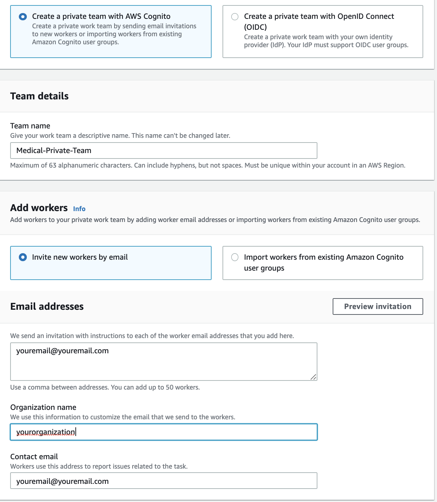
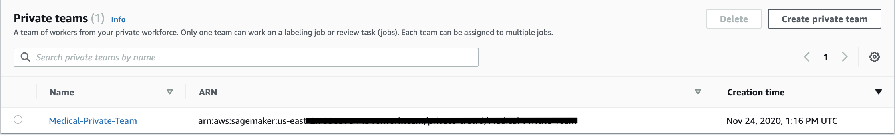
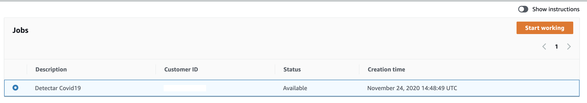
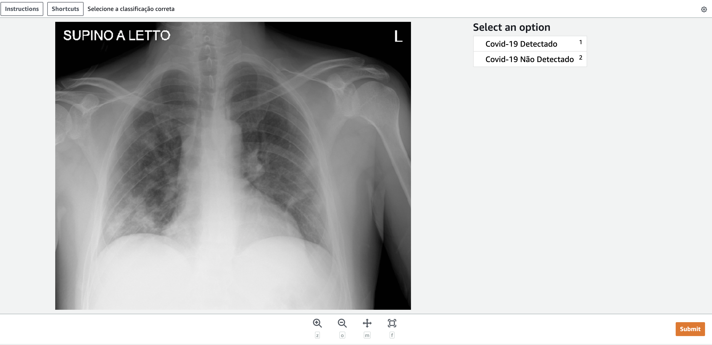

# Utilizando image classification e Augmented AI em imagens de raio-x para detecção de COVID-19 – Part 2

Na parte 1 dessa série de blogposts(https://aws.amazon.com/pt/blogs/aws-brasil/utilizando-image-classification-em-imagens-de-raio-x-para-deteccao-de-covid-19-parte1/), utilizamos o algoritmo builtin da AWS, image classification, para classificar imagens de exames de raios-X de pacientes buscando por indícios de Covid-19. Embora nosso classificador tenha demonstrado um alto valor de confiabilidade com as imagens testadas, podemos ter imagens em que o modelo não tenha uma acurácia aceitável e uma validação de um especialista se faz necessário. 

A validação humana é um caso comum em problemas que envolvem machine learning, para isso a AWS conta com o serviço Amazon Augmented AI(Amazon A2I), que provê as features necessárias para atribuir tarefas a um grupo de usuários que serão responsáveis pela tomada de decisão.

Nesse blogpost criaremos uma workforce com um usuário, criaremos um template para o usuário interagir com a tarefa, criaremos uma tarefa para o usuário com uma imagem da nossa pasta de teste e simularemos um usuário realizando a classificação. o Notebook com todos os passos desse post você pode encontrar aqui: https://github.com/thiagomcouto/covid19_image_classification_part2_amazon_a2i

## Criando a workforce privada

Para iniciarmos nosso trabalho, vamos criar uma workforce privada. Vamos seguir o tutorial do link: https://docs.aws.amazon.com/sagemaker/latest/dg/sms-workforce-create-private-console.html#create-workforce-sm-console

E preencher com os seguintes valores:

* Private team creation: Selecione "Create a private team with AWS Cognito"
* Team Name: Escolha um nome para sua equipe como "Medical-Private-Team"
* Add Workers: Selecione "Invite new workers by email"
* Email Addresses: insire seu e-mail (importante ter acesso a esse e-mail para executar a validação)
* Organization name: Insira um nome relevante para sua organização
* Contact email: insira seu e-mail novamente

Segue exemplo dos campos preenchidos:



Com a private team criada, copie o ARN da sua private team como na imagem abaixo:



Copie o campo na variável abaixo:


```python
privateTeamARN = "<YOUR_PRIVATE_TEAM_ARN>"
```

Agora vamos confirmar nosso e-mail e validar que conseguimos logar na aplicação com sucesso. O e-mail tem o título: <i>"You're invited by YOURORGANIZATION to work on a labeling project"</i>. Clique no link, digite o usuário e senha no e-mail e escolhe uma nova senha.

## Inicializando

Com nossa private team devidamente criada e com nosso cadastro validado, vamos iniciar a criação de um workflow de review de uma imagem, simulando o papel de um médico verificando a imagem de um raio-X e tomando a decisão.

Abaixo vamos fazer inicializar nossas bibliotecas e configurar variáveis para posterior utilização. Para esse blogpost estamos utilizando a região <i>us-east-1</i>.


```python

import uuid
import os
import boto3
import botocore
import random
import numpy as np
import json
import time
import sagemaker

# iniciando a sessão e buscando o bucket default
sess = sagemaker.session.Session()
bucket = sess.default_bucket()

# recuperando a role utilizada nas chamadas
role = get_execution_role()

timestamp = time.strftime("%Y-%m-%d-%H-%M-%S", time.gmtime())

# utilizando a região us-east-1
region = 'us-east-1'

# Amazon SageMaker client
sagemaker_client = boto3.client('sagemaker', region)

# Amazon Augment AI (A2I) client
a2i = boto3.client('sagemaker-a2i-runtime')

# Amazon S3 client 
s3 = boto3.client('s3', region)

# Flow definition name - nome do flow que será criado
flowDefinitionName = 'fd-covid19-demo-' + timestamp

# Task UI name - nome da task que será criada para interação
taskUIName = 'ui-covid19-demo-' + timestamp
```

## Criando o template

Com as variáveis e libs inicializadas, vamos criar o template, esse template será a base da nossa interface gráfica para validação. uma lista de templates de exemplo pode ser encontrada aqui:https://github.com/aws-samples/amazon-a2i-sample-task-uis.


```python
template = r"""
<script src="https://assets.crowd.aws/crowd-html-elements.js"></script>

<crowd-form>
  <crowd-image-classifier
    name="crowd-image-classifier"
    src="{{ task.input.taskObject | grant_read_access }}"
    header="Selecione a classificação correta"
    categories="['Covid-19 Detectado', 'Covid-19 Não Detectado']"
  >
    <full-instructions header="Classification Instructions">
      <p>Analise a imagem e determine o resultado</p>
    </full-instructions>

    <short-instructions>
      <p>Analise a imagem e determine o resultado</p>
    </short-instructions>
  </crowd-image-classifier>
</crowd-form>
"""
```

Com o template definido vamos criar uma taskUI


```python
humanTaskUiResponse = sagemaker_client.create_human_task_ui(
        HumanTaskUiName=taskUIName,
        UiTemplate={'Content': template})

humanTaskUiArn = humanTaskUiResponse['HumanTaskUiArn']

print(humanTaskUiArn)
```

    arn:aws:sagemaker:us-east-1:709657544516:human-task-ui/ui-covid19-demo-2020-11-24-14-19-36


## Definindo o workflow

Na célua abaixo, vamos criar definir um workflow. Basicamente nosso workflow relaciona uma interface para uma tarefa humana, uma equipe(no nosso caso privada) criada anteriormente e um bucket onde vamos armazenar a resposta do nosso usuário que fará a interação com a tarefa. Mais detalhes sobre workflow aqui: https://docs.aws.amazon.com/sagemaker/latest/dg/a2i-create-flow-definition.html


```python
outputPath = 's3://{}/{}/output'.format(bucket, flowDefinitionName)
create_workflow_definition_response = sagemaker_client.create_flow_definition(
        FlowDefinitionName= flowDefinitionName,
        RoleArn= role,
        HumanLoopConfig= {
            "WorkteamArn": privateTeamARN,
            "HumanTaskUiArn": humanTaskUiArn,
            "TaskCount": 1,
            "TaskDescription": "Detectar Covid19",
            "TaskTitle": "Detectar Covid19"
        },
        OutputConfig={
            "S3OutputPath" : outputPath
        }
    )

# armzanenando o arn do flow definition para posterior utilização
flowDefinitionArn = create_workflow_definition_response['FlowDefinitionArn'] 
```

Na célula abaixo validaremos se nosso flow já se encontra ativo o pronto para o uso


```python
# Describe flow definition - status should be active
for x in range(60):
    describeFlowDefinitionResponse = sagemaker_client.describe_flow_definition(FlowDefinitionName=flowDefinitionName)
    print(describeFlowDefinitionResponse['FlowDefinitionStatus'])
    if (describeFlowDefinitionResponse['FlowDefinitionStatus'] == 'Active'):
        print("Flow Definition is active")
        break
    time.sleep(2)
```

    Active
    Flow Definition is active


## Criando um human loop

Após as etapas anteriores, vamos criar um human loop, enviando uma imagem de um raio-x do post anterior para um usuário de nossa private team validar e dar o veredito. Nesse post estou utilizando uma das imagens da nossa pasta de teste da part 1 desse post, para utilizar outra imagem basta alterar o endereço abaixo.


```python
# referência a imagem do post anterior
image =  's3://{}/{}'.format(bucket, "covid19/test/5A78BCA9-5B7A-440D-8A4E-AE7710EA6EAD.jpeg")
```


```python

inputContent = {
            "initialValue": str(0),
            "taskObject": image
        }

humanLoopName = str(uuid.uuid4())


start_loop_response = a2i.start_human_loop(
            HumanLoopName=humanLoopName,
            FlowDefinitionArn=flowDefinitionArn,
            HumanLoopInput={
                "InputContent": json.dumps(inputContent)
            },
            DataAttributes={
                'ContentClassifiers': [
                    'FreeOfPersonallyIdentifiableInformation','FreeOfAdultContent'
                ]
            }
        )
```

## Executando a tarefa

Com a tarefa criada, vamos abri-la e selecionar a classificação correta, para acessar as tarefas pendentes, vamos até o e-mail e abriremos o link recebido(o mesmo que utilizamos para trocar a senha anteriormente). Após logarmos teremos uma visão similar a tela abaixo:



Ao selecionarmos a tarefa e clicarmos em Start working, teremos a tela abaixo:



No caso acima, a imagem pertencia a classe "Detectado". Selecionamos a opção correta(1) e clicamos em <i>"Submit"</i>. A tarefa vai ser finalizada e o resultado vai ser armazenado do s3 informado no momento da criação do flow.

Interessante observar que a tela foi formada com base no nosso template e é amplamente customizável para conter outras categorias, textos, descrições e afins. No link  citado anteriormente temos outras sugestões de templates para criarmos a interface da nossa tarefa.

## Analisando o resultado

Após submeter a tarefa com nossa resposta, os dados da nossa análise são armazenados no S3 que informamos para output, seguindo o padrão YYYY/MM/DD/hh/mm/ss. Essa estrutura torna a resposta particionada e facilmente integrável com AWS Glue e Athena. Mais informações no link: https://docs.aws.amazon.com/sagemaker/latest/dg/a2i-monitor-humanloop-results.html

Vamos utilizar o nome do human loop que armazenamos anteriormente para buscar o local exato do json, faremos a leitura de seu conteúdo e armazenaremos itens importantes para a análise da resposta.


```python
import json
# buscando a human loop
humanLoopResponse = a2i.describe_human_loop(HumanLoopName = humanLoopName)

#lendo o conteúdo
s3Output = humanLoopResponse["HumanLoopOutput"]["OutputS3Uri"]
content = sess.read_s3_file(bucket, s3Output.replace("s3://{}/".format(bucket),""))

#armazenando em variáveis
response = json.loads(content)
answer = response["humanAnswers"][0]["answerContent"]["crowd-image-classifier"]["label"]
taskInput = response["inputContent"]["taskObject"]

```

    [{'answerContent': {'crowd-image-classifier': {'label': 'Covid-19 Detectado'}}, 'submissionTime': '2020-11-24T16:22:44.687Z', 'workerId': '0e62a0c3ec41f607', 'workerMetadata': {'identityData': {'identityProviderType': 'Cognito', 'issuer': 'https://cognito-idp.us-east-1.amazonaws.com/us-east-1_FLSc1OaUr', 'sub': '4aec38d6-0108-4344-9d2a-9757bf0f48a7'}}}]


Na célula abaixo temos a imagem que foi usada para análise e a resposta que submetemos na tarefa


```python
print("Imagem: "+ taskInput + " Resposta do usuário: "+answer)
```

    Imagem: s3://sagemaker-us-east-1-709657544516/covid19/test/5A78BCA9-5B7A-440D-8A4E-AE7710EA6EAD.jpeg Resposta do usuário: Covid-19 Detectado


## Conclusão e próximos passos

Nessa série de blogposts utilizamos um dataset de raios-x torácico previamente classificados entre pacientes detectados ou não com o Covid-19.

Na primera parte exploramos o algoritmo de image classification built-in da AWS, baseado em ResNet, para treinarmos um modelo e fazermos a validação de seu desempenho.

Na segunda parte exploramos a necessidade de termos uma avaliação humana para casos de respostas não acertivas do modelo. Criando um fluxo de análise manual que recebe como input a imagem previamente analisada, cria uma tarefa para um grupo de usuários privados e possibilita que esses usuários analisem as imagens e classifiquem-a corretamente.

Abaixo seguem alguns links relevantes e próximos passos:

Documentação para human review: https://docs.aws.amazon.com/sagemaker/latest/dg/a2i-use-augmented-ai-a2i-human-review-loops.html

Algoritmo de classificação de imagem: https://docs.aws.amazon.com/sagemaker/latest/dg/image-classification.html

Treinamentos oficiais de machine learning: https://aws.amazon.com/training/learn-about/machine-learning/
